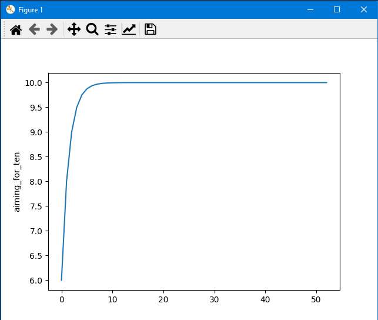

# Aiming for ten algorithm

A simple algorithm for creating simple (not very smooth) animations. This algorithm always strives for `10`. It doesn’t matter what number you set first.

## Formula

```python
start_num = 1

start_num = (start_num / 2) + 5
```

## Test animation
